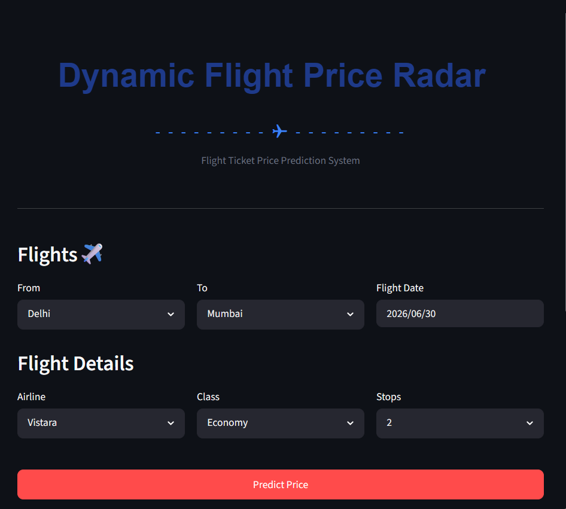

# Flight Price Prediction Radar

 

## Project Overview
This project is an end-to-end Machine Learning pipeline designed to predict dynamic flight ticket prices based on various features such as days left to departure, airline company, flight class, and duration. The core objective is to understand the underlying pricing mechanics of airlines and provide an accurate estimation tool for travelers. 

The dataset used for this project was sourced from **Kaggle**, followed by comprehensive Exploratory Data Analysis (EDA) to extract meaningful patterns before feeding the data into tree-based algorithms.

## Features & Modeling Approach
One of the key technical highlights of this project is the **Model Selection & Tuning Strategy**. Instead of settling for a single model, the architecture is built to automatically evaluate and compare two different approaches:

1. **Baseline Model:** A standard LightGBM Regressor utilizing industry rule-of-thumb hyperparameters (`learning_rate=0.1`, `n_estimators=500`).
2. **Optimized Model (GridSearchCV):** An advanced tuning process using `GridSearchCV` that iterates through a parameter grid (evaluating multiple combinations of `learning_rate`, `n_estimators`, and `num_leaves`) with 3-fold Cross Validation to find the absolute best fit.

The pipeline automatically evaluates both models using **Mean Absolute Error (MAE)** and **R-Squared (R²)** metrics, dynamically saving the superior (Champion) model as a serialized `.pkl` file for deployment.

## Technologies Used
* **Data Processing & EDA:** Pandas, NumPy, Scipy
* **Visualization:** Matplotlib, Seaborn
* **Machine Learning:** Scikit-Learn, LightGBM
* **Web Interface:** Streamlit
* **Model Serialization:** Joblib


**How to Run**
```bash
git clone [https://github.com/irmakoznrgz/flight-fare-radar.git](https://github.com/irmakoznrgz/flight-fare-radar.git)
cd flight-price-prediction
python -m venv venv
# On Windows:
venv\Scripts\activate
# On Mac/Linux:
source venv/bin/activate
pip install -r requirements.txt
python src/model_training.py
streamlit run app.py